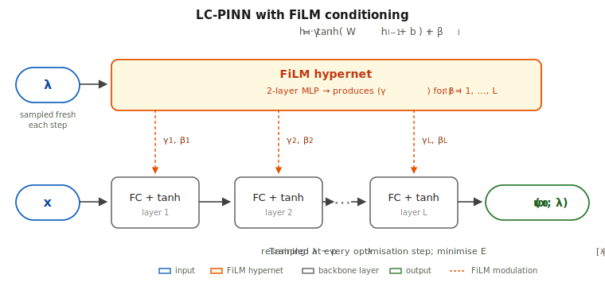

# Loss-Conditional PINNs (LC-PINN)

A single residual-loss PINN training run that produces a continuous family
of PDE solutions over a parameter $\lambda$ — a physical scalar
coefficient (wavenumber, mobility, trap stiffness) or a loss-weight
vector — without paired training data, test-time adaptation, or
per-$\lambda$ retuning. The construction adapts loss-conditional networks
(Dosovitskiy & Djolonga, 2020) to PINN training: $\lambda$ is a network
input drawn fresh from a fixed prior at every optimisation step.

This repository contains two LaTeX submissions of the same work and the
shared PyTorch implementation:

- **`paper_neurips/`** — NeurIPS 2026 main-track submission (9 pp main +
  references + checklist + appendix, anonymous, `neurips_2026.sty`).
  Submitted 2026-05-06.
- **`paper_icml/`** — ICML 2026 AI4Physics workshop submission (8 pp main
  + references + appendix, double-blind, `icml2026.sty`). Adds a new
  Section 4 / Theorem 4.1 (local loss-decay advantage of
  loss-conditioning) authored by Alexander Tarakanov.

---

## Architecture

LC-PINN is a single MLP $u_\theta(x; \lambda)$ that takes spatial
coordinates $x$ and the family parameter $\lambda$ as inputs. Two
conditioning routes are supported; the headline parametric-coefficient
results (Helmholtz, Schrödinger) use **FiLM** (Perez et al., 2018):
$\lambda$ is mapped through a small hypernetwork to per-layer
scale/shift pairs $(\gamma_l, \beta_l)$ that modulate every hidden layer
of the backbone.

<p align="center">
  
</p>

Each hidden layer applies $h_l = \gamma_l \odot \tanh(W_l h_{l-1} + b_l) + \beta_l$.
For loss-weight families ($\lambda = w$ on Burgers / BL) we use the
simpler **concat mode**: $\lambda$ is concatenated with $x$ at the input
and the FiLM hypernet is dropped. Concat is sufficient when $\lambda$
only reweights existing residual terms; FiLM is what produces the
$\sim$10× accuracy lift in parametric-coefficient mode (see Appendix C
of the paper).

**Training loop.** At every optimisation step a fresh $\lambda \sim p_\lambda$
is drawn from a fixed prior (uniform on the parameter range unless
stated otherwise), the per-instance PDE residual
$\mathcal{L}(\lambda; u_\theta(\cdot, \lambda))$ is computed, and one
SGD step is taken on the network parameters $\theta$ (and the FiLM
hypernet). The optimisation target is
$J(\theta) = \mathbb{E}_{\lambda \sim p_\lambda}[\mathcal{L}(\lambda; u_\theta(\cdot, \lambda))]$.
On parametric-coefficient runs Adam is followed by an L-BFGS finishing
pass with a revert-on-worse safety check.

Source: [`pinns/model.py`](pinns/model.py) for the network,
[`pinns/training.py`](pinns/training.py) for the training loop,
[`pinns/lambda_sampler.py`](pinns/lambda_sampler.py) for $p_\lambda$.

---

## Repository layout

| Path | Contents |
|------|----------|
| `paper_neurips/` | NeurIPS 2026 paper source — `main.tex`, `sections/`, `figures/`, `refs.bib`, `neurips_2026.sty`, compiled `main.pdf`. Build instructions in [`paper_neurips/README.md`](paper_neurips/README.md). |
| `paper_icml/` | ICML 2026 AI4Physics workshop source — single-file `main.tex`, `figures/`, `bibliobase.bib`, `icml2026.sty`/`.bst`, compiled `main.pdf`. Adds §4 + Theorem 4.1 (local loss-decay) and Appendix A (derivation). |
| `pinns/` | Core library: `model.py` (LC-PINN with FiLM conditioning), `pi_deeponet.py`, `training.py`, `lambda_sampler.py`, `inference.py`, `device.py`, and equation modules under `pinns/equations/`. |
| `pinns/equations/` | One module per PDE: `helmholtz.py`, `helmholtz_2d.py`, `helmholtz_3d.py`, `schrodinger_1d.py`, `burgers.py`, `buckley_leverett.py`, plus older sandbox modules. Each exposes a uniform API (`reference_solution`, `forcing`, `generate_training_data`, `compute_losses`, `compute_losses_fixed`). |
| `scripts/` | One script per (method, equation) cell — e.g. `lc_pinn_helmholtz.py`, `sa_pinn_helmholtz.py`, `relobralo_helmholtz.py`, plus figure makers (`make_pareto_plot.py`, `make_per_k_plot.py`, `make_per_alpha_plot.py`). |
| `tests/` | `pytest` smoke tests (forcing closed-forms, manufactured-solution residuals). |
| `notebooks/` | Older exploratory notebooks (workshop-era; not used for paper results). |
| `docs/` | Internal worklogs and planning notes. Not part of the paper. |
| `results/` | JSON outputs from training scripts (gitignored). |
| `checkpoints/` | Saved model weights (gitignored). |

---

## Building the papers

Both `paper_neurips/` and `paper_icml/` are self-contained — each
directory carries its own `.sty`, bib, and figures.

```bash
# NeurIPS 2026 main track (9 pp + checklist + appendix)
cd paper_neurips && tectonic -X compile main.tex --reruns 3

# ICML 2026 AI4Physics workshop (8 pp + appendix, includes Theorem 4.1)
cd paper_icml    && tectonic -X compile main.tex --reruns 3
```

See [`paper_neurips/README.md`](paper_neurips/README.md) for the NeurIPS
build's `latexmk` / `pdflatex` alternatives, mode switching, and the rule
that `paper_neurips/sections/abstract.tex` and
`paper_neurips/openreview_submission.md` must stay in sync.

---

## Reproducing the experiments

### Install

```bash
poetry install        # creates .venv with PyTorch, NumPy, SciPy, Matplotlib, tqdm
poetry shell          # or prefix every command with `poetry run`
```

`pinns/device.py::select_device()` automatically picks MPS on Apple
Silicon, CUDA on NVIDIA, otherwise CPU. Do not hardcode a device.

### Run a single experiment

Each `(method, equation)` pair has a one-line entrypoint in `scripts/`.
Example, parametric 1D Helmholtz:

```bash
python scripts/lc_pinn_helmholtz.py        # LC-PINN, FiLM + L-BFGS finishing pass
python scripts/sa_pinn_helmholtz.py        # SA-PINN per-k retraining (5-pt grid)
python scripts/relobralo_helmholtz.py      # ReLoBRaLo per-k retraining
python scripts/pi_deeponet_helmholtz.py    # PI-DeepONet residual-only branch-trunk
```

Each script writes a JSON to `results/<method>_<equation>.json` with
per-seed `rel_l2`, per-$\lambda$ breakdown, wall-clock time, and the
training config used.

### Regenerate paper figures

The committed PDFs in `paper/figures/` are sufficient to build the paper.
To regenerate them from the JSONs:

```bash
python scripts/make_pareto_plot.py          # paper/figures/pareto.pdf
python scripts/make_per_k_plot.py           # paper/figures/per_k_helmholtz.pdf
python scripts/make_per_alpha_plot.py       # paper/figures/per_alpha_schrodinger.pdf
```

### Runtime estimates (Apple M-series, MPS)

| Workload | Wall time |
|----------|-----------|
| LC-PINN 1D Helmholtz, 4 seeds, FiLM+L-BFGS | ~75 min |
| LC-PINN 2D Helmholtz, 4 seeds | ~3 h |
| LC-PINN 3D Helmholtz, 4 seeds | ~5 h |
| SA-PINN / ReLoBRaLo per-k baseline (5 grid points × 4 seeds) | ~6 h |
| LC-PINN Burgers (loss-weight mode), 4 seeds | ~70 min |

---

## Headline results (matching the paper)

- **1D parametric Helmholtz, $k\in[1,10]$.** One LC-PINN training (mean
  rel-$L^2 \approx 9.4\!\times\!10^{-4}$ across the 5-point $k$-grid) is
  the only method whose error stays within one order of magnitude across
  the full range. ReLoBRaLo, retrained per $k$, climbs three orders of
  magnitude from $k{=}1$ to $k{=}10$.
- **Loss-weight amortisation on viscous Burgers ($d_\lambda{=}4$).** One
  LC network breaks even on training compute after ${\sim}4$ retrainings
  ($K^\star \approx 4$) and amortises ${\sim}29\times$ over the strongest
  single-$\lambda$ baseline at $K{=}100$ inferences.
- **Price of amortisation.** ${\sim}2\times$ rel-$L^2$ gap vs. per-$k$
  retrained PINNs — paid once per family, not once per query.

Per-equation tables and the full Pareto frontier are in
[`paper/main.pdf`](paper/main.pdf).

---

## Citation

```bibtex
@misc{lc-pinn-2026,
  title  = {Loss-Conditional PINNs: One Training Run for a Parametric PDE Family},
  author = {Anonymous},
  year   = {2026},
  note   = {Under review at NeurIPS 2026}
}
```

The camera-ready BibTeX entry will replace this once the paper is
de-anonymised.
